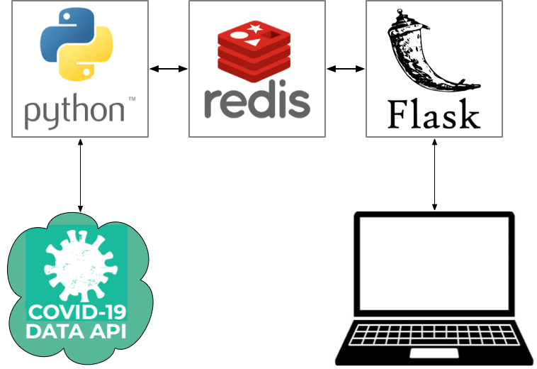

# Base COVID App

The goal of this project is to demonstrate how to set up a simple application with three components:

1. A Python program using [`requests`](https://docs.python-requests.org/en/master/) to collect data.
2. The [redis](https://redis.io/) database to store data
3. A [Flask](https://flask.palletsprojects.com/en/2.0.x/) server launched via [gunicorn](https://gunicorn.org/) to server up the data.

The data used in this example is the current number of confirmed COVID-19 cases from the [COVID-19 API](https://covid19-api.com/).  

The "application" modeled is intentionally minimal: Every 15 minutes, the collector obtains the current count and stores it in the redis database.  The Flask server has a single end point that allows a user to fetch this data.


## System Architecture



## Collector Setup

In the `collector` folder:

* Create a virtual environment for the collector and install the required libraries:

  ```
  python3 -m venv .venv
  source .venv/bin/activate
  pip install -r requirements.txt
  ```

* Create a file `.env` that contains the hostname and port number for Redis.  We will run Redis on our laptop (`localhost`) using the standard Redis port (6379):

  ```
  REDIS_HOST=localhost
  REDIS_PORT=6379
  ```

## Redis Setup

In the root directory of the project:

* Download the latest stable version of [Redis](https://redis.io/)
* Extract the tar ball (archive)

  ```
  tar xvfz ~/Downloads/redis-6.2.6.tar.gz
  ```
* Go into the redis directory and build Redis

  ```
  cd redis-6.2.6 
  make
  ```
  
* Instal Redis on your system

  ```
  make install
  ```
  
## Server Setup

In the `server` folder:

* Create a virtual environment for the collector and install the required libraries:

  ```
  python3 -m venv .venv
  source .venv/bin/activate
  pip install -r requirements.txt
  ```

* Create a file `.env` that contains the hostname and port number for Redis.  We will run Redis on our laptop (`localhost`) using the standard Redis port (6379):

  ```
  REDIS_HOST=localhost
  REDIS_PORT=6379
  ```


## Launch the System

We will launch the system in three terminal windows:

* Terminal #1 (In the project root) Launch Redis:

  ```
  redis-server
  ```
  
* Terminal #2 (In the `collector` folder) Launch the collector:

  ```
  source .venv/bin/activate
  python collector.py
  ```
  
* Terminal #3 (In the `server` folder) Launch the server:

  ```
  source .venv/bin/activate
  python server.py
  ```
  
## Stop the System

In each terminal window, press ctrl-c to stop the program.
    